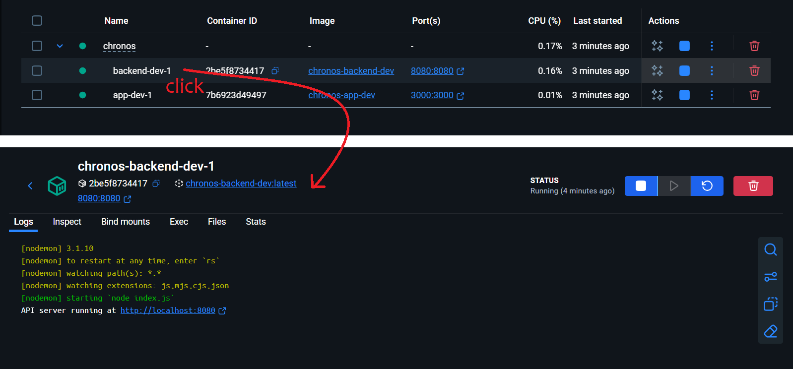

<h1 align="center"></h1>

> **Chronos** is a planning service that helps you manage tasks, set reminders and organize arrangements across multiple calendars.

The application was developed as a solution to the `chronos` challenge of **Track Full Stack**, the last stage of the [**Innovation Campus**](https://campus.kpi.kharkov.ua/en/) educational program. Our team had 5 weeks (November-December 2025) to design and implement the solution.

## Features

// TODO

## Requirements and dependencies

All you need preinstalled is the [**Docker Desktop**](https://docs.docker.com/get-started/introduction/get-docker-desktop/).

### Tech Stack
* [Node.js](https://nodejs.org/en/download)

// TODO full tech stack list

## How to use

Clone the repository to your local machine and navigate to the project directory:

```bash
git clone https://github.com/VeronikaSukhonos/chronos.git
cd chronos
```

Create `.env` file with variables specified in `.env.example` file.     
To get `IP_API_KEY`, register [here](https://ipinfo.io/).

### Build the project

Launch the Docker Desktop, and, in the same directory where `docker-compose.yml` file is located, run the command:

```
docker compose build <app-dev/app-prod>
```

Write `app-dev` to run the development build and `app-prod` to run the production build.

In the development build, you can change files both in `backend` and `frontend` directories (except Docker-related files like Dockerfile), and servers will be restarted automatically.

### Run the app

To run the app, use the following command:

```
docker compose up <app-dev/app-prod>
```

> You can run this command without `docker compose build` - the app will be built first (if not yet) and then automatically launched.

API server will run at:
* `http://localhost:8080` in the development build
* `http://localhost:8888` in the production build

Web application will run at:
* `http://localhost:5173` in the development build
* `http://localhost:8000` in the production build

If you want to see some container's logs, in the Docker Desktop, click on the corresponding container and open Logs tab.



### Stop the app

When you are done, tear the app down by using the command:

```
docker compose down
```

## Team

- [**Polina Rezchyk**](https://github.com/BekkaMushko)
- [**Yevheniia Rezchyk**](https://github.com/EvgeniaRezchik)
- [**Veronika Sukhonos**](https://github.com/VeronikaSukhonos)

## Documentation

Project documentation can be found [**here**](./docs/) and contains:
* description of our experience (activities, findings, problems, conclusions) while working on a project according to Challenge Based Learning (CBL) framework
* description of all API endpoints
* description of the project structure and all features
